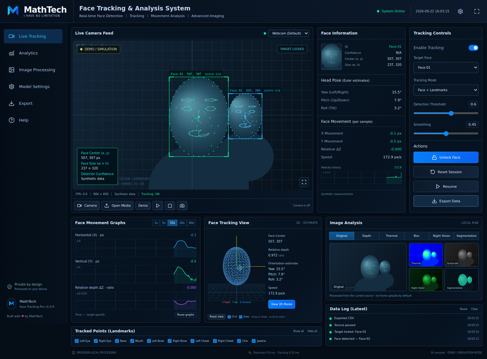

# MathTech Face Tracking & Analysis

**I HAVE NO LIMITATION** · Developed for Shivam Singh, Founder of MathTech.

A working local computer-vision workstation based on the supplied dashboard reference. React + strict TypeScript + MediaPipe + Three.js, with an optional FastAPI / SQLite API. It includes the source, local model files, a prebuilt frontend, Windows/macOS/Linux launchers, tests and documentation.



## Fastest start — no npm install needed

Install Python 3.10+ and open **START-PREBUILT-WINDOWS.bat** on Windows, or run `python scripts/serve.py` from the project folder. Open **http://localhost:8080**. The ZIP includes the compiled application and vision models. Do not double-click `index.html`; browsers require a local web server for modules, workers and camera access.

For source development install **Node.js 22 LTS or newer**:

```bash
cd frontend
npm ci
npm run dev
```

Open **http://localhost:5173**. The first package installation needs internet. The application itself serves its WASM runtime and models locally; there are no CDN requests or default frame uploads.

Windows users can use `START-DEVELOPMENT-WINDOWS.bat`. On macOS/Linux run `bash start-development.sh`.

## Use the application

1. Select **Start Camera**, grant permission, and look toward the webcam; or use **Open Media** for a JPEG, PNG, WebP, MP4, WebM or Ogg file.
2. **Launch Demo** provides clearly labeled synthetic subjects without requesting a camera.
3. Select a face from the target selector or click its bounding box, then **Lock Face**. The lock is a spatial track, not recognition of a person.
4. Inspect X/Y/relative Z, speed, pose, graphs, 3D orientation, and image-processing views.
5. Use **Export** to download CSV, session JSON, a Markdown report, event log, raw PNG or annotated PNG. Save numeric sessions locally and load them after refresh.
6. **Stop source** immediately stops all webcam tracks. Raw video recording requires a separate explicit action under Model Settings.

## Implemented modules

- Desktop dashboard following the supplied navy/blue/green reference; responsive layouts and optional light/system themes.
- Webcam selection and resolution requests; image/video import, play/pause, seek, playback speed and approximate 1/30-second stepping.
- Real MediaPipe face landmarks (478 points), separate detector confidence, multi-face tracking, session IDs, spatial target association, locking, smoothing and timed reacquisition.
- Raw and smoothed centers, timestamp-based velocity/acceleration, movement trails, head pose estimates, per-face graph histories, selected-landmark movement and geometric signals.
- Three.js orientation view with orbit, zoom, reset, grid and axes.
- Original, derived depth, false-color thermal, four blur variants, RGB night-vision style, grayscale, edges, geometric face segmentation, contrast and sharpen.
- Analytics, coordinate modes, overlay and landmark-group toggles, heatmaps, settings persistence, local IndexedDB sessions, bounded history, logging and exports.
- Keyboard shortcuts, camera/model error states, user-controlled raw recording, no default telemetry or biometric identity database.
- Optional API for explicit frame analysis and separate SQLite numeric session storage.

## Measurement boundaries

Depth readout is `initial face width / current face width`, a **relative apparent-size ratio**, not a distance in meters. Depth imaging is a **stylized radial visualization within the face mask**, not a learned or sensor depth map. Thermal uses RGB intensity, not temperature. Segmentation uses the face-oval polygon, not hair/body semantic segmentation. Pose comes from the face transformation matrix; the 3D head is a generic orientation indicator. Eye/mouth/blink outputs are geometric/model movement signals, not health, emotion or identity conclusions.

Tracking uses spatial association. Crossing faces, occlusion and fast motion can exchange IDs. Lost tracks expire after the configured timeout. Confidence is N/A when the separate detector cannot be matched, and always N/A in synthetic demo mode. No invented percentages are shown.

## Optional backend

The frontend does not require Python or the backend when run through Vite/Docker. The prebuilt launcher uses Python only as a static web server.

```bash
python -m venv .venv
# Windows: .venv\Scripts\activate
# macOS/Linux: source .venv/bin/activate
pip install -r backend/requirements.txt
python -m uvicorn backend.app.main:app --host 127.0.0.1 --port 8000
```

API docs: **http://127.0.0.1:8000/docs**. The API loads the same bundled models on the first frame request. It stores numeric sessions in `backend/data/sessions.db`. Browser sessions remain in IndexedDB and are not automatically copied to the API database.

To expose the explicit backend-processing toggle, copy `frontend/.env.example` to `frontend/.env`, set `VITE_ENABLE_BACKEND=true`, and restart/rebuild. Set `VITE_API_URL` to your API origin. Enabling the toggle stops the existing source; reopening a source sends frames to that API. The default is disabled. This local single-user API has no multi-user authentication; keep its port on loopback or add an authenticated gateway before shared hosting.

## Build and test

```bash
cd frontend
npm test
npm run build
npx playwright install chromium
npm run test:e2e
```

Backend: `python -m pytest tests/test_api.py -q` from the project root after installing backend requirements. See [TESTING.md](docs/TESTING.md) for actual validation results and hardware limits.

## Docker

```bash
docker compose up --build
```

Open **http://localhost:8080**. Add the optional backend with `docker compose --profile backend up --build`. Ports are bound to loopback. Docker builds require internet for dependencies. The backend can also run on a private Docker-capable server; the frontend `dist` folder works on static hosts such as Netlify/Vercel. Use HTTPS on remote hosts for camera permission.

## Environment

| Variable | Default | Purpose |
|---|---|---|
| VITE_API_URL | http://127.0.0.1:8000 | Explicit backend endpoint |
| VITE_ENABLE_BACKEND | false | Show opt-in frame-upload processing toggle |
| VITE_ENABLE_DEMO_MODE | true | Enable synthetic demo |
| MATHTECH_DB | backend/data/sessions.db | API SQLite location |
| MATHTECH_MODELS | frontend/public/models | API model directory |
| ALLOWED_ORIGINS | localhost development origins | Exact API CORS origins |

## Troubleshooting

- Camera unavailable: use localhost/HTTPS, allow site permission, close other camera apps, and select the correct camera. No physical camera is needed for uploaded media or Demo.
- Model unavailable: ensure `frontend/public/models` and `frontend/public/wasm` exist. `npm ci` restores the WASM runtime. Prebuilt mode uses the copies in `frontend/dist`.
- Slow tracking: reduce resolution, max faces, target FPS or increase frame skip. 30 FPS is a target dependent on hardware, not a guarantee.
- Unsupported video codec: convert to H.264 MP4 or WebM. Browser decoding support determines available formats.
- Saved sessions missing: use the same browser and origin; IndexedDB is origin-specific. Export JSON before clearing browser data.
- Video seeking starts a new numeric session to avoid mixing timelines. Save/export first if you want to retain the current segment.

## Structure

```text
frontend/src/components/  Dashboard, controls, charts, 3D and pages
frontend/src/core/        Tracking math, association, imaging, session utilities
frontend/src/services/    Source lifecycle and centralized external store
frontend/src/workers/     Local MediaPipe worker
frontend/public/          Bundled models and WASM runtime
frontend/dist/            Ready-to-serve production build
backend/app/              Optional FastAPI + SQLite implementation
tests/                    Backend integration tests
frontend/tests/           Unit and browser workflow tests
docs/                     Architecture, CV, privacy, API and testing notes
scripts/                  Prebuilt application launcher
```

The software is functional source for a local research/engineering workstation. It is not a certified measurement device or an audited multi-tenant cloud service. Third-party dependencies and model licenses remain with their owners; see [THIRD_PARTY.md](docs/THIRD_PARTY.md).
